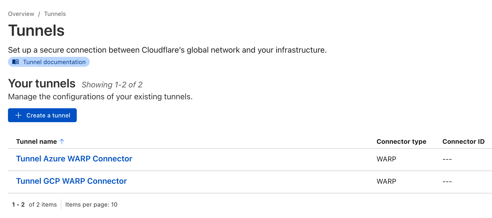
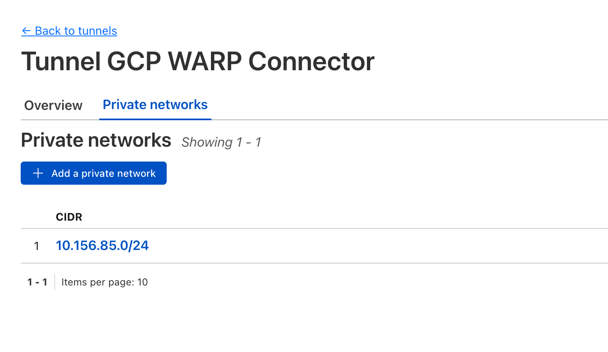
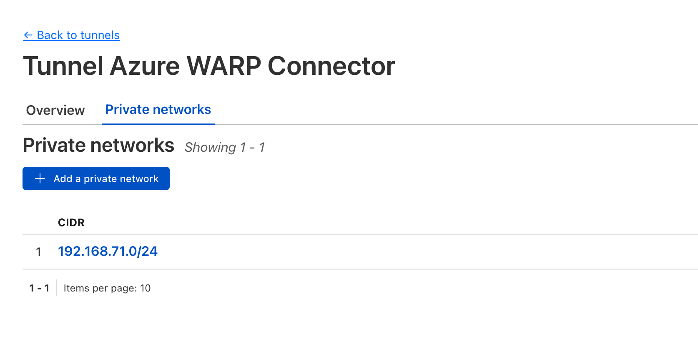
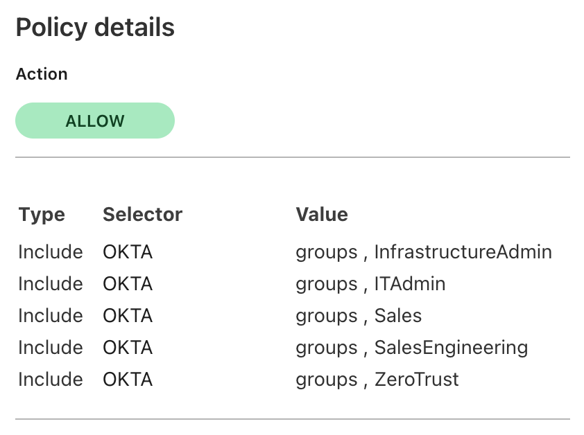
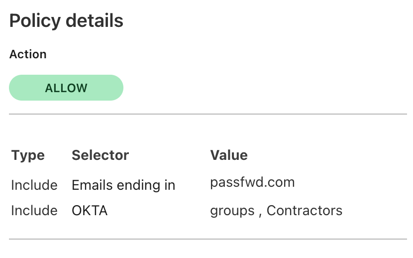
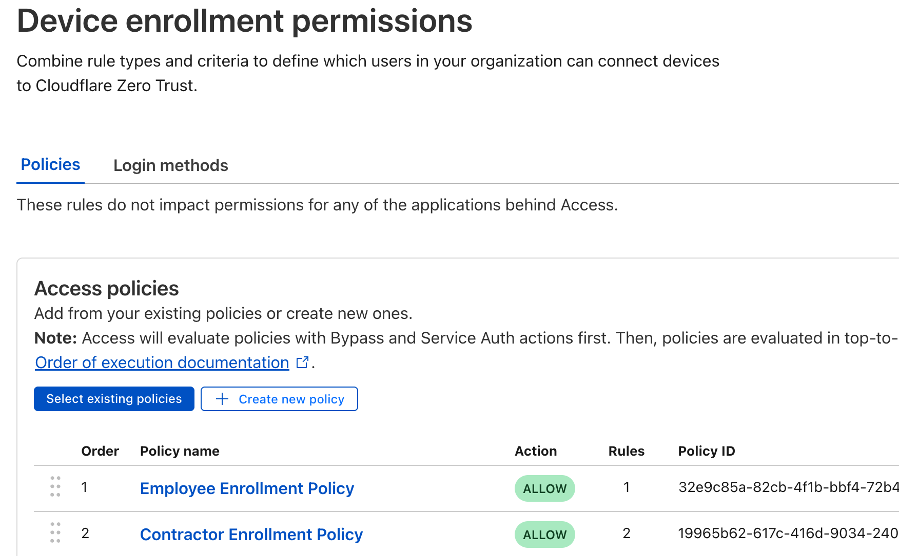
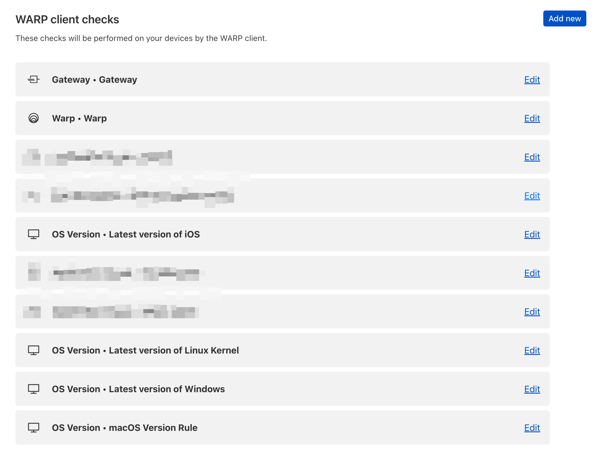

# Cloudflare Zero Trust Demo Environment

A comprehensive, production-ready Terraform infrastructure that demonstrates Cloudflare's Zero Trust capabilities across multi-cloud environments. This project showcases advanced security policies, identity integration, and seamless connectivity between AWS, Azure, and GCP

[](https://github.com/macharpe/terraform-cloudflare-zero-trust-demo/commits/main)
[](https://dashboard.infracost.io/org/macharpe/repos/8bce00d3-4748-4e36-b419-a8dde3817846?tab=branches)
[](https://www.terraform.io/)
[](https://registry.terraform.io/providers/cloudflare/cloudflare/latest)
[](https://www.cloudflare.com/zero-trust/)
[](https://github.com/macharpe/terraform-cloudflare-zero-trust-demo)
[](https://www.datadoghq.com/)

> **Note**: This is a work in progress 🚧. While functional, I intend to maintain and improve it continuously based on community feedback and evolving best practices.

## 📑 Table of Contents

- [🌟 Features](#-features)
- [🔧 Integration with Cloudflare Workers (Optional)](#-integration-with-cloudflare-workers-optional)
  - [Training Status Admin Portal](#training-status-admin-portal)
  - [Access Denied Info Page](#access-denied-info-page)
- [🏗️ Architecture Overview](#️-architecture-overview)
- [📊 Project Statistics](#-project-statistics)
- [📚 Background Reading](#-background-reading)
- [📋 Prerequisites](#-prerequisites)
- [🛠️ Step-by-Step Setup](#️-step-by-step-setup)
  - [1. Clone and Initialize](#1-clone-and-initialize)
  - [2. Configure Cloudflare API Token Permissions](#2-configure-cloudflare-api-token-permissions)
  - [3. Configure Environment Variables](#3-configure-environment-variables)
  - [4. Manual Cloudflare UI Setup](#4-manual-cloudflare-ui-setup)
  - [5. Configure terraform.tfvars](#5-configure-terraformtfvars)
  - [6. Configure Backend (First-Time Setup)](#6-configure-backend-first-time-setup)
  - [7. Deploy Infrastructure](#7-deploy-infrastructure)
  - [8. Post-Deployment Configuration](#8-post-deployment-configuration)
  - [🎁 BONUS: VNC Installation Monitoring](#-bonus-vnc-installation-monitoring)
  - [🎁 BONUS: Automated update of posture check rules macOS and iOS to latest version](#-bonus-automated-update-of-posture-check-rules-macos-and-ios-to-latest-version)
- [🔧 Environment Management](#-environment-management)
- [🧹 Cleanup and Destruction](#-cleanup-and-destruction)
- [🚀 Roadmap](#-roadmap)
- [🤝 Contributing](#-contributing)
- [📄 License](#-license)
- [📚 Terraform Documentation](#-terraform-documentation)

## 🌟 Features

- **Multi-Cloud Architecture**: Seamless integration across AWS, Azure, and GCP
- **Zero Trust Security**: Complete implementation of Cloudflare's SASE platform
- **Identity Integration**: Support for Okta, Azure AD, and custom identity providers
- **Advanced Networking**: WARP Connector tunnels and private network routing
- **Infrastructure as Code**: Fully automated with Terraform
- **Real-World Use Cases**: Browser rendering, RDP access, infrastructure management, and external validation for training compliance
- **Automated Cleanup**: Built-in scripts for environment management
- **Device Posture Checks**: OS version compliance and security validation
- **Policy-Based Access**: Role-based access control with comprehensive policies

## 🔧 Integration with Cloudflare Workers (Optional)

This demo environment includes **two optional components** that integrate with Cloudflare Workers and can be enabled based on your specific requirements:

### Training Status Admin Portal

An optional Cloudflare Access application that integrates with the **Training Compliance Gateway** for advanced training status tracking and compliance evaluation.

- **File**: `modules/cloudflare/access_applications_optional.tf`
- **Requirements**: Requires the [Training Compliance Gateway](https://github.com/macharpe/cloudflare-access-training-evaluator) Cloudflare Worker to be deployed
- **Features**:
  - Training status tracking and compliance evaluation
  - **External validation use case**: Demonstrates how to require training completion before app access (perfect for compliance scenarios where users must pass training to access sensitive applications)
  - Integration with Competition App policy for conditional access
  - Multi-path domain configuration (`/admin`, `/api/*`, `/admin*`, `/init-db`)

#### Worker Configuration

When deploying this component, Terraform will output the `TRAINING_STATUS_ADMIN_PORTAL_AUD` value, which is the unique Application Audience (AUD) Tag required for the Training Compliance Gateway worker authentication.

**Setup Steps:**

1. **Deploy this Terraform configuration** - The AUD value will be available in outputs
2. **Configure the worker secret** using the AUD value:
   ```bash
   # Get the AUD value from Terraform output
   terraform output TRAINING_STATUS_ADMIN_PORTAL_AUD

   # Set the worker secret (replace with your actual AUD value)
   echo "8a47b4391d556b42e9c7b0bba0d3896c7579bd0ffad37453b608bc489ed070fc" | wrangler secret put ACCESS_APP_AUD --name cloudflare-access-training-evaluator
   ```

3. **Deploy/update the worker** - After setting the secret, deploy or redeploy your worker:
   ```bash
   wrangler deploy --name cloudflare-access-training-evaluator
   ```

   > **Note**: The worker needs to be redeployed after setting the `ACCESS_APP_AUD` secret to ensure the new configuration is loaded properly.

> **⚠️ Important Notes:**
> - The Training Status Admin Portal app and policy will only function if the Training Compliance Gateway is deployed and running
> - If you haven't deployed the Training Compliance Gateway, you must comment out the `require_external_evaluation` settings in the Competition App Policy (located in `modules/cloudflare/access_policies.tf`), otherwise the Competition App won't work or appear in the App Launcher
> - Repository: [Training Compliance Gateway for Cloudflare Worker](https://github.com/macharpe/cloudflare-access-training-evaluator)

### Access Denied Info Page

An optional custom Access-denied-info-page that provides users with detailed information and guidance when access is denied to protected applications.

- **Requirements**: Requires the [Cloudflare Access-denied-info-page](https://github.com/macharpe/cloudflare-access-denied-info-page) to be deployed on Cloudflare Pages
- **Features**:
  - Professional custom denial page with branding and guidance
  - User-friendly explanations for access denial reasons
  - Contact information and support resources
  - Consistent experience across all protected applications

> **⚠️ Important Notes:**
> - If you don't want to use the custom Access denied page, you must remove the `custom_deny_url` and `custom_non_identity_deny_url` parameters from every access application in `modules/cloudflare/access_applications.tf`
> - Repository: [Cloudflare Access-denied-info-page](https://github.com/macharpe/cloudflare-access-denied-info-page)

## 🏗️ Architecture Overview

This demo environment creates a sophisticated Zero Trust network spanning three major cloud providers, connected through Cloudflare's global network.

_Last Updated: 27th of September 2025_


*The architecture demonstrates how Cloudflare Zero Trust creates secure, identity-aware connections between resources across multiple cloud providers without traditional VPN complexity.*

## 📊 **Project Statistics**

### 📁 **Core Project Overview**
- **Total Deployed Resources**: 168 resources *(in Terraform state)*
- **Resource Definitions**: 94 resources *(in .tf files)*
- **Module Directories**: 5 directories *(modular architecture)*

### 📝 **Core Code Files**
| File Type | Count | Lines | Purpose |
|-----------|-------|-------|---------|
| Terraform (.tf) | 34 | ~5200 | Infrastructure as Code |
| Documentation (.md) | 11 | ~2700 | Project documentation |
| Scripts (.sh) | 4 | ~500 | Cleanup & maintenance |
| HTML (.html) | 3 | ~1100 | Demo applications |
| Python (.py) | 2 | ~300 | WARP routing utilities |
| Templates (.tfpl, .tpl, .cmd) | 2 | ~400 | Cloud-init & startup scripts |
| **Total Core Code** | **56** | **~10200** | **Production-ready infrastructure** |

<table>
<tr>
<td valign="top">

**📁 Infrastructure Resources** *(via terraform state)*

- **168** total resources deployed
- **94** resource definitions in code
- **33** Terraform files
- **5** custom modules
- **Multi-provider** architecture

</td>
<td valign="top">

**☁️ Cloud Distribution** *(from terraform state)*

- **74** Cloudflare resources (41%)
- **47** Other module resources (26%)
- **20** Google Cloud resources (11%)
- **19** AWS resources (10%)
- **18** Azure resources (10%)
- **2** Null resources (1%)
- **1** Data source

</td>
</tr>
<tr>
<td valign="top">

**🔧 Architecture Features**

- **Multi-cloud** (AWS, Azure, GCP)
- **Zero Trust** security model
- **Identity integration** (Okta, Azure AD)
- **WARP Connector** cross-cloud routing
- **Browser-rendered** services (SSH, VNC, RDP)
- **External validation** showcasing training compliance

</td>
<td valign="top">

**🚀 Automation & Quality**

- **API token authentication** (modernized 2025)
- **Role-based infrastructure** deployment
- **Modular design** with 5 specialized modules
- **100%** Infrastructure as Code coverage
- **Enhanced initialization** with comprehensive error handling

</td>
</tr>
</table>


## 📚 Background Reading

For detailed context and implementation insights, check out this comprehensive blog series:

- **Part 1**: [Building a Scalable Zero Trust Demo environment with Cloudflare and Terraform](https://www.linkedin.com/pulse/building-scalable-zero-trust-demo-environment-part-1-charpentier-ntgoe/?trackingId=bl5ST2%2FDTgW7ueBjhaW0hw%3D%3D)
- **Part 2**: [Automating Cloudflare Zero Trust at Scale: Terraform, Multi-Cloud, and Identity](https://www.linkedin.com/pulse/automating-cloudflare-zero-trust-scale-terraform-part-charpentier-ova1e/)
- **Part 3**: [Zero Trust for Real-World Scenarios: Use Cases and Extensions](https://www.linkedin.com/pulse/zero-trust-real-world-scenarios-use-cases-extensions-part-matthieu-t5qee/)

## 📋 Prerequisites

Before deploying this infrastructure, ensure you have the following accounts and tools configured:

### Required Accounts

- **Cloudflare Account** with Zero Trust enabled
- **Okta Developer Account** for identity management
- **Azure Account** with appropriate subscription
- **AWS Account** with programmatic access
- **GCP Account** with service account configured
- **Registered Domain** managed by Cloudflare
- **Meraki Account** (for SaaS app demos)
- **Datadog Account** (for observability features)

### Required Tools

- **Terraform** >= 1.12.0
- **AWS CLI** configured with credentials
- **Azure CLI** configured with subscription
- **Google Cloud SDK** with service account
- **Git** for version control

## 🛠️ Step-by-Step Setup

### 1. Clone and Initialize

```bash
git clone https://github.com/macharpe/terraform-cloudflare-zero-trust-demo
cd terraform-cloudflare-zero-trust-demo
cp terraform.tfvars.example terraform.tfvars
```

### 2. Configure Cloudflare API Token Permissions

Before setting up environment variables, ensure your Cloudflare API token has the following permissions:

**Account-Level Permissions:**
- **Cloudflare One Connector: WARP** - Edit
- **Cloudflare One Connector: cloudflared** - Edit
- **Access: SSH Auditing** - Edit
- **Cloudflare Tunnel** - Edit
- **Access: Service Tokens** - Edit
- **Zero Trust** - Edit
- **Access: Organizations, Identity Providers, and Groups** - Edit
- **Account Settings** - Read
- **Access: Apps and Policies** - Edit

**Zone-Level Permissions:**
- **Zone Settings** - Read
- **DNS** - Edit

**Account Resources:**
- Include: All accounts

**Zone Resources:** 
- Include: All zones

### 3. Configure Environment Variables

Create a `.envrc` file (or set environment variables) with your credentials:

```bash
# Cloudflare
export TF_VAR_cloudflare_api_token="your_cloudflare_api_token"
export TF_VAR_cloudflare_account_id="your_account_id"
export TF_VAR_cloudflare_zone_id="your_zone_id"

# AWS
export AWS_ACCESS_KEY_ID="your_aws_access_key"
export AWS_SECRET_ACCESS_KEY="your_aws_secret_key"

# Azure
export TF_VAR_azure_tenant_id="your_azure_tenant_id"
export TF_VAR_azure_subscription_id="your_azure_subscription_id"

# Google Cloud
export GOOGLE_APPLICATION_CREDENTIALS="path/to/your/service-account.json"
export TF_VAR_gcp_project_id="your_gcp_project_id"

# Datadog
export TF_VAR_datadog_api_key="your_datadog_api_key"
```

### 4. Manual Cloudflare UI Setup

Due to Terraform provider limitations, some resources must be created manually in the Cloudflare dashboard:

#### SaaS Applications and Identity Providers

**Important Note**: All SaaS applications in Cloudflare Access (Okta, Meraki, AWS, etc.) as well as Identity Providers (Okta SAML, Azure AD, OneTime PIN) are manually configured and **not managed by Terraform**. These must be set up through the Cloudflare dashboard before deploying the Terraform infrastructure.

This includes:
- Okta SAML Identity Provider configuration
- Azure AD Identity Provider setup
- OneTime PIN Identity Provider
- SaaS application integrations (Okta, Meraki, AWS)
- Custom rule groups and posture checks

#### WARP Connector Setup

1. **Create WARP Connector Tunnels**:
   - Navigate to **Networks > Tunnels > Create tunnel**
   - Select **Warp Connector** (not cloudflared)
   - Create two tunnels as shown below:

   

2. **Configure Private Routes**:
   - **Azure WARP Connector**: Add route for `azure_subnet_cidr` variable (e.g., 192.168.71.0/24)
   - **GCP WARP Connector**: Add route for `gcp_warp_cidr` variable (e.g., 10.156.85.0/24)

   
   

3. **Retrieve Tunnel IDs**: Copy the tunnel IDs and add them to your `terraform.tfvars`:
   ```hcl
   cf_warp_tunnel_azure_id = "185f0bc0-986d-46c............."
   cf_warp_tunnel_gcp_id   = "ad04a3ed-a1a1-460........"
   ```

#### Device Enrollment Policies

Create two enrollment policies in **Settings > WARP Client**:

1. **Employee Enrollment Policy**:
   - Allow users in any Okta group to enroll devices
   
   

2. **Contractor Enrollment Policy**:
   - Allow users with `@passfwd` email domain OR in "Contractors" Okta group
   
   

**Final Device Enrollment Permissions**:



#### WARP Client Checks Configuration

Configure device posture checks as shown:




### 5. Configure terraform.tfvars

Copy `terraform.tfvars.example` to `terraform.tfvars` and customize the values for your environment:

```bash
cp terraform.tfvars.example terraform.tfvars
```

The configuration file is organized into logical sections for easy navigation:

- **🏗️ GCP Configuration**: Project settings, VM configurations, and networking
- **☁️ Cloudflare Configuration**: Tunnels, WARP connectors, applications, and security policies  
- **🔐 Okta Configuration**: Identity provider groups and user management
- **⚡ AWS Configuration**: EC2 instances, networking, and security groups
- **🔷 Azure Configuration**: Resource groups, VMs, and Active Directory integration
- **📊 Datadog Configuration**: Monitoring and observability settings

**Key variables requiring manual configuration:**

```hcl
# WARP Connector Tunnels - Sensitive: manually retrieved from Cloudflare dashboard
cf_warp_tunnel_azure_id = "your_azure_warp_tunnel_id"
cf_warp_tunnel_gcp_id   = "your_gcp_warp_tunnel_id"

# Identity Providers - Sensitive: manually retrieved from Cloudflare dashboard
cf_okta_identity_provider_id  = "your_okta_provider_id"
cf_azure_identity_provider_id = "your_azure_provider_id"

# Device Posture - Sensitive: manually retrieved from Cloudflare dashboard
cf_gateway_posture_id = "your_gateway_posture_id"
cf_macos_posture_id   = "your_macos_posture_id"
cf_windows_posture_id = "your_windows_posture_id"

# SAML Group IDs - Sensitive: manually retrieved from Okta
okta_infra_admin_group_id = "your_infra_admin_group_id"
okta_contractors_group_id = "your_contractors_group_id"
```


### 6. Configure Backend (First-Time Setup)

**Backend Infrastructure Repository**: The backend infrastructure code is available at: [cloudflare-zero-trust-demo-backend](https://github.com/macharpe/cloudflare-zero-trust-demo-backend)

```bash
# Copy backend configuration template
cp backend.conf.example backend.conf

# Edit backend.conf with your actual AWS S3 values
# Note: This file is gitignored for security
```

Edit `backend.conf` with your S3 bucket details from your separate backend infrastructure project. Follow the setup instructions in the [backend repository](https://github.com/macharpe/cloudflare-zero-trust-demo-backend) to deploy the S3 + DynamoDB infrastructure first.

### 7. Deploy Infrastructure

```bash
# Initialize Terraform with backend configuration
terraform init -backend-config=backend.conf

# Review the deployment plan
terraform plan

# Deploy the infrastructure
terraform apply
```

> **⚠️ Important**: For subsequent operations (plan, apply, destroy), you don't need to specify the backend config again. Terraform remembers the backend configuration after the initial setup.

> **🚀 Performance Note**: Cleanup scripts are optimized for demo workflows using a "Demo-First" approach. They only run when VMs are created/changed, not on every `terraform apply`, providing 40-50% faster apply times during demo sessions.

### 8. Post-Deployment Configuration

After Terraform completes successfully:

1. **Assign SaaS App Policies**: Manually assign policies to SaaS applications (Okta, Meraki, etc.) in the Cloudflare dashboard
2. **Test Connectivity**: Verify access to resources across all cloud providers
3. **Configure User Access**: Set up user accounts and test Zero Trust policies

### 🎁 BONUS: VNC Installation Monitoring

The AWS VNC instance hosting the XFCE4 desktop environment requires **10-15 minutes** to complete installation depending on instance type:
- **t3.micro** (2 vCPU, 1GB RAM): ~10-12 minutes setup time, $7.59/month
- **t3.small** (2 vCPU, 2GB RAM): ~5-7 minutes setup time, $15.18/month (recommended for demos)

**Installation Monitoring** 🔄

```bash
# SSH into the VNC instance
ssh ubuntu@<vnc-instance-ip> -i modules/keys/out/aws_vnc_service_key_pair

# Quick status check with vnc-status command (automatically in PATH)
vnc-status

# Alternative: Monitor detailed installation progress
tail -f /tmp/vnc-setup.log

# Or watch real-time progress updates
tail -f /tmp/vnc-progress.txt
```

**What to Expect:**
- **Phase 1-2** (0-2 minutes): Repository configuration and package updates
- **Phase 3-4** (2-8 minutes): VNC and XFCE4 desktop installation (TigerVNC for Ubuntu 24.04)
- **Phase 5-6** (8-10 minutes): User configuration and VNC authentication setup
- **Phase 7-8** (10-12 minutes): Systemd service configuration and VNC server startup

**vnc-status Command Output:**

```bash
=== VNC Server Status ===
✅ VNC setup completed
   VNC setup completed at Tue Sep 30 09:38:29 CEST 2025

=== Service Status ===
🟢 VNC service: Running
🟢 Port 5901: Listening

=== Connection Info ===
📍 Hostname: cloudflare-zero-trust-demo-vnc-aws
🔐 VNC Port: 5901
🔑 Password: Set in ~/.vnc/passwd

=== Active Sessions ===
📊 Active VNC processes: 2
   /usr/bin/perl
   /usr/bin/Xtigervnc
```

**Features:**
- ✅ Real-time installation progress with 8-phase tracking and percentage completion
- ✅ Comprehensive service status monitoring (systemd service + port listening check)
- ✅ Automatic port detection using `lsof`, `ss`, and `netstat` fallbacks
- ✅ Active VNC process monitoring and connection information
- ✅ Built-in troubleshooting tips if service fails to start
- ✅ Command available in PATH with tab completion support

**Instance Type Configuration:**

The project supports independent instance type sizing for optimal cost/performance balance:
- Configure `aws_ec2_vnc_instance_type` separately from other AWS instances
- See [terraform.tfvars](terraform.tfvars) for detailed cost/performance comparison
- Recommendation: Use `t3.small` for demo environments for faster setup and better desktop responsiveness

### 🎁 BONUS: Automated update of posture check rules macOS and iOS to latest version

> ⚠️ **WARP SSL Inspection Considerations:**
>
> If you're running WARP client with SSL inspection enabled, you may encounter certificate validation errors when the script contacts Apple's API. To resolve this:
>
> **Option 1:** Add `gdmf.apple.com` to your WARP "Do Not Inspect" list:
> - Go to Settings > Network > Do Not Inspect
> - Add domain: `gdmf.apple.com`
> - Description: "Apple macOS version API for posture script"
>
> **Option 2:** The script includes the `-k` flag as a fallback for SSL certificate bypassing

This project includes automated scripts that keep your Cloudflare device posture rules up-to-date with the latest operating system versions from Apple.

#### macOS Version Posture Script

The `latest_osx_version_posture.sh` script automatically updates Cloudflare device posture rules with the latest macOS version. This script:

- Fetches the current macOS version from Apple's API (gdmf.apple.com)
- Reads the posture rule ID from terraform.tfvars
- Updates the Cloudflare Zero Trust posture rule via API

#### iOS Version Posture Script

The `latest_ios_version_posture.sh` script automatically updates Cloudflare device posture rules with the latest iOS version. This script:

- Fetches the current iOS version from Apple's API (gdmf.apple.com)
- Reads the posture rule ID from terraform.tfvars
- Updates the Cloudflare Zero Trust posture rule via API

#### Usage

```bash
# Run the macOS script
./modules/cloudflare/scripts/latest_osx_version_posture.sh

# Run the iOS script
./modules/cloudflare/scripts/latest_ios_version_posture.sh
```

Both scripts automatically determine the latest available version and update your Zero Trust posture policies accordingly, ensuring your device compliance requirements stay current with Apple's releases.

## 🔧 Environment Management

### Automated Cleanup Scripts

This environment includes automated cleanup utilities:

#### SSH Known Hosts Cleanup

The `known_hosts_cleanup.py` script automatically removes SSH host entries to prevent conflicts when VMs are recreated with the same IP addresses.

**Setup**:
```bash
# Add this line to your ~/.ssh/known_hosts file:
#################### BELOW IS SAFE TO DELETE #########################
```

This prevents the common SSH warning:
```
@@@@@@@@@@@@@@@@@@@@@@@@@@@@@@@@@@@@@@@@@@@@@@@@@@@@@@@@@@@
@    WARNING: REMOTE HOST IDENTIFICATION HAS CHANGED!     @
@@@@@@@@@@@@@@@@@@@@@@@@@@@@@@@@@@@@@@@@@@@@@@@@@@@@@@@@@@@
```

#### Cloudflare Devices Cleanup

The `cloudflare_devices_cleanup.sh` script removes clutter from **My Team > Devices** in the Cloudflare dashboard, cleaning up WARP connector device registrations.


## 🧹 Cleanup and Destruction

Before destroying the environment:

1. **Remove SaaS App Policies**: Manually remove policies from SaaS applications in Cloudflare dashboard
2. **Run Terraform Destroy**:
   ```bash
   terraform destroy
   ```
3. **Clean Up Manual Resources**: Remove manually created WARP connectors and policies

## 🚀 Roadmap

Planned enhancements and features:

- **Enhanced Secret Management**: Implement SSM Parameter Store for AWS and equivalents for other cloud providers
- **Advanced Security Groups**: More granular network security configurations
- **Enhanced Observability**: Advanced Datadog integration and monitoring
- **Additional Identity Providers**: Support for more enterprise identity systems
- **Post-Quantum Cryptography**: Implementation of [post-quantum algorithms](https://blog.cloudflare.com/post-quantum-zero-trust/) for future-proof encryption and Zero Trust communications

## 🤝 Contributing

Contributions are welcome! Please feel free to submit issues, feature requests, or pull requests to help improve this demonstration environment.

## 📄 License

This project is provided as-is for educational and demonstration purposes. Please review and adapt the security configurations for your production environment.

---

*For questions or support, please open an issue in this repository or refer to the blog series linked above.*

<!-- BEGIN_TF_DOCS -->
## Requirements

| Name | Version |
|------|---------|
| <a name="requirement_terraform"></a> [terraform](#requirement\_terraform) | >= 1.12.0 |
| <a name="requirement_aws"></a> [aws](#requirement\_aws) | ~> 6.0 |
| <a name="requirement_azuread"></a> [azuread](#requirement\_azuread) | ~> 3.4 |
| <a name="requirement_azurerm"></a> [azurerm](#requirement\_azurerm) | ~> 4.0 |
| <a name="requirement_cloudflare"></a> [cloudflare](#requirement\_cloudflare) | ~> 5.12.0 |
| <a name="requirement_google"></a> [google](#requirement\_google) | ~> 7.0 |
| <a name="requirement_http"></a> [http](#requirement\_http) | ~> 3.4 |
| <a name="requirement_null"></a> [null](#requirement\_null) | ~> 3.2 |
| <a name="requirement_random"></a> [random](#requirement\_random) | ~> 3.6 |
| <a name="requirement_tls"></a> [tls](#requirement\_tls) | ~> 4.0 |

## Providers

| Name | Version |
|------|---------|
| <a name="provider_aws"></a> [aws](#provider\_aws) | ~> 6.0 |
| <a name="provider_azurerm"></a> [azurerm](#provider\_azurerm) | ~> 4.0 |
| <a name="provider_google"></a> [google](#provider\_google) | ~> 7.0 |
| <a name="provider_http"></a> [http](#provider\_http) | ~> 3.4 |
| <a name="provider_null"></a> [null](#provider\_null) | ~> 3.2 |

## Modules

| Name | Source | Version |
|------|--------|---------|
| <a name="module_azure_ad"></a> [azure\_ad](#module\_azure\_ad) | ./modules/azure | n/a |
| <a name="module_cloudflare"></a> [cloudflare](#module\_cloudflare) | ./modules/cloudflare | n/a |
| <a name="module_ssh_keys"></a> [ssh\_keys](#module\_ssh\_keys) | ./modules/keys | n/a |
| <a name="module_warp_routing"></a> [warp\_routing](#module\_warp\_routing) | ./modules/warp-routing | n/a |

## Resources

| Name | Type |
|------|------|
| [aws_eip.nat_eip](https://registry.terraform.io/providers/hashicorp/aws/latest/docs/resources/eip) | resource |
| [aws_instance.aws_vm_cloudflared](https://registry.terraform.io/providers/hashicorp/aws/latest/docs/resources/instance) | resource |
| [aws_instance.aws_vm_service](https://registry.terraform.io/providers/hashicorp/aws/latest/docs/resources/instance) | resource |
| [aws_instance.aws_vm_vnc](https://registry.terraform.io/providers/hashicorp/aws/latest/docs/resources/instance) | resource |
| [aws_internet_gateway.igw](https://registry.terraform.io/providers/hashicorp/aws/latest/docs/resources/internet_gateway) | resource |
| [aws_key_pair.aws_ec2_cloudflared_key_pair](https://registry.terraform.io/providers/hashicorp/aws/latest/docs/resources/key_pair) | resource |
| [aws_key_pair.aws_ec2_service_key_pair](https://registry.terraform.io/providers/hashicorp/aws/latest/docs/resources/key_pair) | resource |
| [aws_key_pair.aws_ec2_vnc_key_pair](https://registry.terraform.io/providers/hashicorp/aws/latest/docs/resources/key_pair) | resource |
| [aws_nat_gateway.nat](https://registry.terraform.io/providers/hashicorp/aws/latest/docs/resources/nat_gateway) | resource |
| [aws_route_table.private_rt](https://registry.terraform.io/providers/hashicorp/aws/latest/docs/resources/route_table) | resource |
| [aws_route_table.public_rt](https://registry.terraform.io/providers/hashicorp/aws/latest/docs/resources/route_table) | resource |
| [aws_route_table_association.private](https://registry.terraform.io/providers/hashicorp/aws/latest/docs/resources/route_table_association) | resource |
| [aws_route_table_association.public](https://registry.terraform.io/providers/hashicorp/aws/latest/docs/resources/route_table_association) | resource |
| [aws_security_group.aws_sg_cloudflared](https://registry.terraform.io/providers/hashicorp/aws/latest/docs/resources/security_group) | resource |
| [aws_security_group.aws_sg_ssh](https://registry.terraform.io/providers/hashicorp/aws/latest/docs/resources/security_group) | resource |
| [aws_security_group.aws_sg_vnc](https://registry.terraform.io/providers/hashicorp/aws/latest/docs/resources/security_group) | resource |
| [aws_subnet.aws_subnet_private](https://registry.terraform.io/providers/hashicorp/aws/latest/docs/resources/subnet) | resource |
| [aws_subnet.aws_subnet_public](https://registry.terraform.io/providers/hashicorp/aws/latest/docs/resources/subnet) | resource |
| [aws_vpc.aws_vpc_main](https://registry.terraform.io/providers/hashicorp/aws/latest/docs/resources/vpc) | resource |
| [azurerm_linux_virtual_machine.azure_vm_linux](https://registry.terraform.io/providers/hashicorp/azurerm/latest/docs/resources/linux_virtual_machine) | resource |
| [azurerm_nat_gateway.cloudflare_natgw](https://registry.terraform.io/providers/hashicorp/azurerm/latest/docs/resources/nat_gateway) | resource |
| [azurerm_nat_gateway_public_ip_association.natgw_ip](https://registry.terraform.io/providers/hashicorp/azurerm/latest/docs/resources/nat_gateway_public_ip_association) | resource |
| [azurerm_network_interface.nic](https://registry.terraform.io/providers/hashicorp/azurerm/latest/docs/resources/network_interface) | resource |
| [azurerm_network_interface_security_group_association.main](https://registry.terraform.io/providers/hashicorp/azurerm/latest/docs/resources/network_interface_security_group_association) | resource |
| [azurerm_network_security_group.azure_nsg_main](https://registry.terraform.io/providers/hashicorp/azurerm/latest/docs/resources/network_security_group) | resource |
| [azurerm_public_ip.nat_gateway_public_ip](https://registry.terraform.io/providers/hashicorp/azurerm/latest/docs/resources/public_ip) | resource |
| [azurerm_public_ip.public_ip](https://registry.terraform.io/providers/hashicorp/azurerm/latest/docs/resources/public_ip) | resource |
| [azurerm_resource_group.cloudflare_rg](https://registry.terraform.io/providers/hashicorp/azurerm/latest/docs/resources/resource_group) | resource |
| [azurerm_route_table.cloudflare_route_table_warp](https://registry.terraform.io/providers/hashicorp/azurerm/latest/docs/resources/route_table) | resource |
| [azurerm_subnet.azure_subnet_main](https://registry.terraform.io/providers/hashicorp/azurerm/latest/docs/resources/subnet) | resource |
| [azurerm_subnet_nat_gateway_association.cloudflare_natgw_association](https://registry.terraform.io/providers/hashicorp/azurerm/latest/docs/resources/subnet_nat_gateway_association) | resource |
| [azurerm_subnet_route_table_association.azure_subnet_route_assoc](https://registry.terraform.io/providers/hashicorp/azurerm/latest/docs/resources/subnet_route_table_association) | resource |
| [azurerm_virtual_network.azure_vnet_main](https://registry.terraform.io/providers/hashicorp/azurerm/latest/docs/resources/virtual_network) | resource |
| [google_compute_address.cloud_nat_ip](https://registry.terraform.io/providers/hashicorp/google/latest/docs/resources/compute_address) | resource |
| [google_compute_firewall.gcp_fw_egress_all](https://registry.terraform.io/providers/hashicorp/google/latest/docs/resources/compute_firewall) | resource |
| [google_compute_firewall.gcp_fw_egress_ssh_deny](https://registry.terraform.io/providers/hashicorp/google/latest/docs/resources/compute_firewall) | resource |
| [google_compute_firewall.gcp_fw_ingress_icmp](https://registry.terraform.io/providers/hashicorp/google/latest/docs/resources/compute_firewall) | resource |
| [google_compute_firewall.gcp_fw_ingress_ssh](https://registry.terraform.io/providers/hashicorp/google/latest/docs/resources/compute_firewall) | resource |
| [google_compute_firewall.gcp_fw_ingress_ssh_deny](https://registry.terraform.io/providers/hashicorp/google/latest/docs/resources/compute_firewall) | resource |
| [google_compute_instance.gcp_vm_cloudflared](https://registry.terraform.io/providers/hashicorp/google/latest/docs/resources/compute_instance) | resource |
| [google_compute_instance.gcp_vm_warp](https://registry.terraform.io/providers/hashicorp/google/latest/docs/resources/compute_instance) | resource |
| [google_compute_instance.gcp_vm_windows_rdp](https://registry.terraform.io/providers/hashicorp/google/latest/docs/resources/compute_instance) | resource |
| [google_compute_network.gcp_vpc_main](https://registry.terraform.io/providers/hashicorp/google/latest/docs/resources/compute_network) | resource |
| [google_compute_route.default_route](https://registry.terraform.io/providers/hashicorp/google/latest/docs/resources/compute_route) | resource |
| [google_compute_route.route_to_aws_subnet](https://registry.terraform.io/providers/hashicorp/google/latest/docs/resources/compute_route) | resource |
| [google_compute_route.route_to_azure_subnet](https://registry.terraform.io/providers/hashicorp/google/latest/docs/resources/compute_route) | resource |
| [google_compute_route.route_to_warp_subnet](https://registry.terraform.io/providers/hashicorp/google/latest/docs/resources/compute_route) | resource |
| [google_compute_router.cloud_router](https://registry.terraform.io/providers/hashicorp/google/latest/docs/resources/compute_router) | resource |
| [google_compute_router_nat.cloud_nat](https://registry.terraform.io/providers/hashicorp/google/latest/docs/resources/compute_router_nat) | resource |
| [google_compute_subnetwork.gcp_subnet_cloudflared](https://registry.terraform.io/providers/hashicorp/google/latest/docs/resources/compute_subnetwork) | resource |
| [google_compute_subnetwork.gcp_subnet_warp](https://registry.terraform.io/providers/hashicorp/google/latest/docs/resources/compute_subnetwork) | resource |
| [google_compute_subnetwork.gcp_subnet_windows_rdp](https://registry.terraform.io/providers/hashicorp/google/latest/docs/resources/compute_subnetwork) | resource |
| [null_resource.cleanup_devices](https://registry.terraform.io/providers/hashicorp/null/latest/docs/resources/resource) | resource |
| [null_resource.cleanup_known_hosts](https://registry.terraform.io/providers/hashicorp/null/latest/docs/resources/resource) | resource |
| [http_http.my_ip](https://registry.terraform.io/providers/hashicorp/http/latest/docs/data-sources/http) | data source |

## Inputs

| Name | Description | Type | Default | Required |
|------|-------------|------|---------|:--------:|
| <a name="input_aws_cloudflared_count"></a> [aws\_cloudflared\_count](#input\_aws\_cloudflared\_count) | number of cloudflared replicas | `number` | `1` | no |
| <a name="input_aws_ec2_browser_ssh_name"></a> [aws\_ec2\_browser\_ssh\_name](#input\_aws\_ec2\_browser\_ssh\_name) | Name of the EC2 instance browser rendered SSH | `string` | n/a | yes |
| <a name="input_aws_ec2_browser_vnc_name"></a> [aws\_ec2\_browser\_vnc\_name](#input\_aws\_ec2\_browser\_vnc\_name) | Name of the EC2 instance browser rendered VNC | `string` | n/a | yes |
| <a name="input_aws_ec2_cloudflared_name"></a> [aws\_ec2\_cloudflared\_name](#input\_aws\_ec2\_cloudflared\_name) | name of cloudflared replica | `string` | n/a | yes |
| <a name="input_aws_ec2_instance_config_ami_id"></a> [aws\_ec2\_instance\_config\_ami\_id](#input\_aws\_ec2\_instance\_config\_ami\_id) | AMI ID representing the VM type and ID to be used | `string` | `"ami-086ecbd485d8bb032"` | no |
| <a name="input_aws_ec2_instance_config_type"></a> [aws\_ec2\_instance\_config\_type](#input\_aws\_ec2\_instance\_config\_type) | type of EC2 instance for SSH and cloudflared instances | `string` | `"t3.micro"` | no |
| <a name="input_aws_ec2_vnc_instance_type"></a> [aws\_ec2\_vnc\_instance\_type](#input\_aws\_ec2\_vnc\_instance\_type) | type of EC2 instance specifically for VNC desktop VM (t3.small recommended for better desktop performance) | `string` | `"t3.micro"` | no |
| <a name="input_aws_private_cidr"></a> [aws\_private\_cidr](#input\_aws\_private\_cidr) | AWS private subnet, subnet for VMs in AWS | `string` | n/a | yes |
| <a name="input_aws_public_cidr"></a> [aws\_public\_cidr](#input\_aws\_public\_cidr) | AWS public subnet | `string` | n/a | yes |
| <a name="input_aws_region"></a> [aws\_region](#input\_aws\_region) | AWS region | `string` | `"eu-central-1"` | no |
| <a name="input_aws_use_spot_instances"></a> [aws\_use\_spot\_instances](#input\_aws\_use\_spot\_instances) | Whether to use spot instances for AWS EC2 (false = on-demand for reliability, true = spot for cost savings) | `bool` | `false` | no |
| <a name="input_aws_users"></a> [aws\_users](#input\_aws\_users) | List of all the AWS users | `list(string)` | n/a | yes |
| <a name="input_aws_vm_default_user"></a> [aws\_vm\_default\_user](#input\_aws\_vm\_default\_user) | default user for AWS VM | `string` | n/a | yes |
| <a name="input_aws_vnc_password"></a> [aws\_vnc\_password](#input\_aws\_vnc\_password) | VNC password for AWS VM | `string` | n/a | yes |
| <a name="input_aws_vpc_cidr"></a> [aws\_vpc\_cidr](#input\_aws\_vpc\_cidr) | AWS vpc cidr, subnet for vpc in AWS | `string` | n/a | yes |
| <a name="input_azure_default_tags"></a> [azure\_default\_tags](#input\_azure\_default\_tags) | default tags for Azure | `map(string)` | <pre>{<br/>  "Environment": "Dev",<br/>  "Owner": "macharpe",<br/>  "Service": "cloudflare-zero-trust-demo"<br/>}</pre> | no |
| <a name="input_azure_developer1_name"></a> [azure\_developer1\_name](#input\_azure\_developer1\_name) | User 1 in Azure AD | `string` | n/a | yes |
| <a name="input_azure_developer2_name"></a> [azure\_developer2\_name](#input\_azure\_developer2\_name) | User 2 in Azure AD | `string` | n/a | yes |
| <a name="input_azure_image_offer"></a> [azure\_image\_offer](#input\_azure\_image\_offer) | Azure VM image offer | `string` | `"ubuntu-22_04-lts"` | no |
| <a name="input_azure_image_publisher"></a> [azure\_image\_publisher](#input\_azure\_image\_publisher) | Azure VM image publisher | `string` | `"Canonical"` | no |
| <a name="input_azure_image_sku"></a> [azure\_image\_sku](#input\_azure\_image\_sku) | Azure VM image SKU | `string` | `"server"` | no |
| <a name="input_azure_image_version"></a> [azure\_image\_version](#input\_azure\_image\_version) | Azure VM image version | `string` | `"latest"` | no |
| <a name="input_azure_matthieu_user_object_id"></a> [azure\_matthieu\_user\_object\_id](#input\_azure\_matthieu\_user\_object\_id) | Object ID in Azure for user Matthieu | `string` | n/a | yes |
| <a name="input_azure_public_dns_domain"></a> [azure\_public\_dns\_domain](#input\_azure\_public\_dns\_domain) | Azure Public DNS Domain | `string` | n/a | yes |
| <a name="input_azure_resource_group_name"></a> [azure\_resource\_group\_name](#input\_azure\_resource\_group\_name) | Ressource Group Name | `string` | n/a | yes |
| <a name="input_azure_resource_group_region"></a> [azure\_resource\_group\_region](#input\_azure\_resource\_group\_region) | Location for all resources | `string` | `"Germany West Central"` | no |
| <a name="input_azure_sales1_name"></a> [azure\_sales1\_name](#input\_azure\_sales1\_name) | User 3 in Azure AD | `string` | n/a | yes |
| <a name="input_azure_sales2_name"></a> [azure\_sales2\_name](#input\_azure\_sales2\_name) | User 4 in Azure AD | `string` | n/a | yes |
| <a name="input_azure_subnet_cidr"></a> [azure\_subnet\_cidr](#input\_azure\_subnet\_cidr) | Azure address prefix, subnet for VM in Azure | `string` | n/a | yes |
| <a name="input_azure_subscription_id"></a> [azure\_subscription\_id](#input\_azure\_subscription\_id) | Azure Subscription ID | `string` | n/a | yes |
| <a name="input_azure_user_password"></a> [azure\_user\_password](#input\_azure\_user\_password) | Password for Azure AD users | `string` | n/a | yes |
| <a name="input_azure_user_principal_domain"></a> [azure\_user\_principal\_domain](#input\_azure\_user\_principal\_domain) | Domain for users created in Azure AD | `string` | n/a | yes |
| <a name="input_azure_vm_admin_password"></a> [azure\_vm\_admin\_password](#input\_azure\_vm\_admin\_password) | Administrator password (min 12 characters) | `string` | n/a | yes |
| <a name="input_azure_vm_admin_username"></a> [azure\_vm\_admin\_username](#input\_azure\_vm\_admin\_username) | Administrator username | `string` | n/a | yes |
| <a name="input_azure_vm_count"></a> [azure\_vm\_count](#input\_azure\_vm\_count) | number of Azure VM | `number` | `1` | no |
| <a name="input_azure_vm_name"></a> [azure\_vm\_name](#input\_azure\_vm\_name) | Azure VM name where WARP Connector is NOT installed | `string` | n/a | yes |
| <a name="input_azure_vm_size"></a> [azure\_vm\_size](#input\_azure\_vm\_size) | Azure VM size | `string` | `"Standard_B1ls"` | no |
| <a name="input_azure_vnet_cidr"></a> [azure\_vnet\_cidr](#input\_azure\_vnet\_cidr) | Azure address vnet, subnet for vnet in Azure | `string` | n/a | yes |
| <a name="input_azure_warp_vm_name"></a> [azure\_warp\_vm\_name](#input\_azure\_warp\_vm\_name) | Name of the Azure VM where WARP Connector is installed | `string` | n/a | yes |
| <a name="input_cf_aws_tag"></a> [cf\_aws\_tag](#input\_cf\_aws\_tag) | tag to be assigned to aws environment | `string` | n/a | yes |
| <a name="input_cf_azure_admin_rule_group_id"></a> [cf\_azure\_admin\_rule\_group\_id](#input\_cf\_azure\_admin\_rule\_group\_id) | Azure Administrators Rule Group ID in Cloudflare | `string` | n/a | yes |
| <a name="input_cf_azure_identity_provider_id"></a> [cf\_azure\_identity\_provider\_id](#input\_cf\_azure\_identity\_provider\_id) | Azure Entra ID identity provider ID in Cloudflare | `string` | n/a | yes |
| <a name="input_cf_browser_rdp_app_name"></a> [cf\_browser\_rdp\_app\_name](#input\_cf\_browser\_rdp\_app\_name) | Name of the RDP windows browser rendered App in Cloudflare | `string` | n/a | yes |
| <a name="input_cf_browser_ssh_app_name"></a> [cf\_browser\_ssh\_app\_name](#input\_cf\_browser\_ssh\_app\_name) | Name of the Browser Rendering SSH App in Cloudflare | `string` | n/a | yes |
| <a name="input_cf_browser_vnc_app_name"></a> [cf\_browser\_vnc\_app\_name](#input\_cf\_browser\_vnc\_app\_name) | Name of the Browser Rendering VNC App in Cloudflare | `string` | n/a | yes |
| <a name="input_cf_cloudflare_tag"></a> [cf\_cloudflare\_tag](#input\_cf\_cloudflare\_tag) | tag name to be assigned to cloudflare zero trust access applications | `string` | n/a | yes |
| <a name="input_cf_competition_app_port"></a> [cf\_competition\_app\_port](#input\_cf\_competition\_app\_port) | Port for the Competition web App in Cloudflare | `number` | n/a | yes |
| <a name="input_cf_custom_cgnat_routes"></a> [cf\_custom\_cgnat\_routes](#input\_cf\_custom\_cgnat\_routes) | List of custom CGNAT routes to add to the device profile | <pre>list(object({<br/>    address     = string<br/>    description = string<br/>  }))</pre> | n/a | yes |
| <a name="input_cf_default_cgnat_routes"></a> [cf\_default\_cgnat\_routes](#input\_cf\_default\_cgnat\_routes) | default cgnat routes | <pre>list(object({<br/>    address     = string<br/>    description = string<br/>  }))</pre> | <pre>[<br/>  {<br/>    "address": "100.64.0.0/10",<br/>    "description": "Default CGNAT Range"<br/>  }<br/>]</pre> | no |
| <a name="input_cf_device_os"></a> [cf\_device\_os](#input\_cf\_device\_os) | This is the OS you are running on your own client machine | `string` | n/a | yes |
| <a name="input_cf_domain_controller_rdp_port"></a> [cf\_domain\_controller\_rdp\_port](#input\_cf\_domain\_controller\_rdp\_port) | Port for the Domain Controller RDP in Cloudflare | `number` | n/a | yes |
| <a name="input_cf_email_domain"></a> [cf\_email\_domain](#input\_cf\_email\_domain) | Email Domain used for email authentication in App policies | `string` | n/a | yes |
| <a name="input_cf_gateway_posture_id"></a> [cf\_gateway\_posture\_id](#input\_cf\_gateway\_posture\_id) | Gateway posture ID in Cloudflare | `string` | n/a | yes |
| <a name="input_cf_infra_app_name"></a> [cf\_infra\_app\_name](#input\_cf\_infra\_app\_name) | Name of the Infrastructure App in Cloudflare | `string` | n/a | yes |
| <a name="input_cf_intranet_app_port"></a> [cf\_intranet\_app\_port](#input\_cf\_intranet\_app\_port) | Port for the Intranet web App in Cloudflare | `number` | n/a | yes |
| <a name="input_cf_intranet_web_app_name"></a> [cf\_intranet\_web\_app\_name](#input\_cf\_intranet\_web\_app\_name) | Name of the Intranet web App in Cloudflare | `string` | n/a | yes |
| <a name="input_cf_ios_posture_id"></a> [cf\_ios\_posture\_id](#input\_cf\_ios\_posture\_id) | Latest iOS version posture ID in Cloudflare | `string` | n/a | yes |
| <a name="input_cf_linux_posture_id"></a> [cf\_linux\_posture\_id](#input\_cf\_linux\_posture\_id) | Latest Linux Kernel version posture ID in Cloudflare | `string` | n/a | yes |
| <a name="input_cf_macos_posture_id"></a> [cf\_macos\_posture\_id](#input\_cf\_macos\_posture\_id) | Latest macOS version posture ID in Cloudflare | `string` | n/a | yes |
| <a name="input_cf_okta_identity_provider_id"></a> [cf\_okta\_identity\_provider\_id](#input\_cf\_okta\_identity\_provider\_id) | Okta Identity Provider ID in Cloudflare | `string` | n/a | yes |
| <a name="input_cf_otp_identity_provider_id"></a> [cf\_otp\_identity\_provider\_id](#input\_cf\_otp\_identity\_provider\_id) | OneTime PIN identity provider ID in Cloudflare | `string` | n/a | yes |
| <a name="input_cf_sensitive_web_app_name"></a> [cf\_sensitive\_web\_app\_name](#input\_cf\_sensitive\_web\_app\_name) | Name of the Sensitive web App in Cloudflare | `string` | n/a | yes |
| <a name="input_cf_subdomain_rdp"></a> [cf\_subdomain\_rdp](#input\_cf\_subdomain\_rdp) | Name of the subdomain for rdp browser rendered public hostname | `string` | n/a | yes |
| <a name="input_cf_subdomain_ssh"></a> [cf\_subdomain\_ssh](#input\_cf\_subdomain\_ssh) | Name of the subdomain for ssh public hostname of tunnel | `string` | n/a | yes |
| <a name="input_cf_subdomain_training_status"></a> [cf\_subdomain\_training\_status](#input\_cf\_subdomain\_training\_status) | Name of the subdomain for training status admin portal (OPTIONAL: only needed if using optional-cloudflare-apps.tf) | `string` | n/a | yes |
| <a name="input_cf_subdomain_vnc"></a> [cf\_subdomain\_vnc](#input\_cf\_subdomain\_vnc) | Name of the subdomain for VNC public hostname of tunnel | `string` | n/a | yes |
| <a name="input_cf_subdomain_web"></a> [cf\_subdomain\_web](#input\_cf\_subdomain\_web) | Name of the subdomain for web public hostname of tunnel | `string` | n/a | yes |
| <a name="input_cf_subdomain_web_sensitive"></a> [cf\_subdomain\_web\_sensitive](#input\_cf\_subdomain\_web\_sensitive) | Name of the subdomain for web sensitive public hostname of tunnel | `string` | n/a | yes |
| <a name="input_cf_target_rdp_name"></a> [cf\_target\_rdp\_name](#input\_cf\_target\_rdp\_name) | Friendly name for the Target hostname in RDP windows browser rendered App | `string` | n/a | yes |
| <a name="input_cf_target_ssh_name"></a> [cf\_target\_ssh\_name](#input\_cf\_target\_ssh\_name) | Friendly name for the Target hostname in Infrastructure App | `string` | n/a | yes |
| <a name="input_cf_team_name"></a> [cf\_team\_name](#input\_cf\_team\_name) | Name of the Team in Cloudflare, essentially zero-trust org name | `string` | n/a | yes |
| <a name="input_cf_tunnel_name_aws"></a> [cf\_tunnel\_name\_aws](#input\_cf\_tunnel\_name\_aws) | Name of the Cloudflare tunnel to AWS | `string` | n/a | yes |
| <a name="input_cf_tunnel_name_gcp"></a> [cf\_tunnel\_name\_gcp](#input\_cf\_tunnel\_name\_gcp) | Name of the Cloudflare tunnel to GCP | `string` | n/a | yes |
| <a name="input_cf_warp_cgnat_cidr"></a> [cf\_warp\_cgnat\_cidr](#input\_cf\_warp\_cgnat\_cidr) | default ip range for WARP when overriding local interface IP | `string` | n/a | yes |
| <a name="input_cf_warp_tunnel_azure_id"></a> [cf\_warp\_tunnel\_azure\_id](#input\_cf\_warp\_tunnel\_azure\_id) | ID of the WARP Connector Tunnel manually created for Azure in UI | `string` | n/a | yes |
| <a name="input_cf_warp_tunnel_gcp_id"></a> [cf\_warp\_tunnel\_gcp\_id](#input\_cf\_warp\_tunnel\_gcp\_id) | ID of the WARP Connector Tunnel manually created for GCP in UI | `string` | n/a | yes |
| <a name="input_cf_windows_posture_id"></a> [cf\_windows\_posture\_id](#input\_cf\_windows\_posture\_id) | Latest Windows version posture ID in Cloudflare | `string` | n/a | yes |
| <a name="input_cf_windows_rdp_tunnel_name"></a> [cf\_windows\_rdp\_tunnel\_name](#input\_cf\_windows\_rdp\_tunnel\_name) | Name of the Cloudflared tunnel for Windows RDP Server GCP | `string` | n/a | yes |
| <a name="input_cloudflare_account_id"></a> [cloudflare\_account\_id](#input\_cloudflare\_account\_id) | Cloudflare account ID | `string` | n/a | yes |
| <a name="input_cloudflare_api_token"></a> [cloudflare\_api\_token](#input\_cloudflare\_api\_token) | Cloudflare API token | `string` | n/a | yes |
| <a name="input_cloudflare_zone_id"></a> [cloudflare\_zone\_id](#input\_cloudflare\_zone\_id) | Cloudflare zone ID | `string` | n/a | yes |
| <a name="input_datadog_api_key"></a> [datadog\_api\_key](#input\_datadog\_api\_key) | Datadog API Key from https://app.datadoghq.com/organization-settings/api-keys | `string` | n/a | yes |
| <a name="input_datadog_region"></a> [datadog\_region](#input\_datadog\_region) | location of the datadog region | `string` | `"datadoghq.eu"` | no |
| <a name="input_gcp_cloudflared_vm_name"></a> [gcp\_cloudflared\_vm\_name](#input\_gcp\_cloudflared\_vm\_name) | Name for the VM instance running cloudflared for infrastructure access demo | `string` | n/a | yes |
| <a name="input_gcp_enable_oslogin"></a> [gcp\_enable\_oslogin](#input\_gcp\_enable\_oslogin) | Whether to enable OS Login | `bool` | `true` | no |
| <a name="input_gcp_infra_cidr"></a> [gcp\_infra\_cidr](#input\_gcp\_infra\_cidr) | CIDR Range for GCP VMs running cloudflared | `string` | n/a | yes |
| <a name="input_gcp_linux_image"></a> [gcp\_linux\_image](#input\_gcp\_linux\_image) | GCP Linux image for compute instances | `string` | `"ubuntu-os-cloud/ubuntu-2204-lts-amd64"` | no |
| <a name="input_gcp_machine_size"></a> [gcp\_machine\_size](#input\_gcp\_machine\_size) | size of the compute engine instance | `string` | `"e2-micro"` | no |
| <a name="input_gcp_project_id"></a> [gcp\_project\_id](#input\_gcp\_project\_id) | GCP project ID | `string` | n/a | yes |
| <a name="input_gcp_region"></a> [gcp\_region](#input\_gcp\_region) | GCP Region | `string` | `"europe-west3"` | no |
| <a name="input_gcp_service_account_email"></a> [gcp\_service\_account\_email](#input\_gcp\_service\_account\_email) | Service Account email for Terraform project in GCP | `string` | n/a | yes |
| <a name="input_gcp_users"></a> [gcp\_users](#input\_gcp\_users) | List of all the GCP users | `list(string)` | n/a | yes |
| <a name="input_gcp_vm_count"></a> [gcp\_vm\_count](#input\_gcp\_vm\_count) | number of vm not running cloudflared | `number` | `1` | no |
| <a name="input_gcp_vm_default_user"></a> [gcp\_vm\_default\_user](#input\_gcp\_vm\_default\_user) | default vm user for GCP VM | `string` | n/a | yes |
| <a name="input_gcp_vm_name"></a> [gcp\_vm\_name](#input\_gcp\_vm\_name) | Name for the VM instance NOT running cloudflared | `string` | n/a | yes |
| <a name="input_gcp_warp_cidr"></a> [gcp\_warp\_cidr](#input\_gcp\_warp\_cidr) | CIDR Range for GCP VMs running warp | `string` | n/a | yes |
| <a name="input_gcp_warp_connector_image"></a> [gcp\_warp\_connector\_image](#input\_gcp\_warp\_connector\_image) | GCP image specifically for WARP connector VM (Ubuntu 22.04 for compatibility) | `string` | `"ubuntu-os-cloud/ubuntu-2204-lts"` | no |
| <a name="input_gcp_warp_connector_vm_name"></a> [gcp\_warp\_connector\_vm\_name](#input\_gcp\_warp\_connector\_vm\_name) | Name of the GCP VM where WARP Connector is installed | `string` | n/a | yes |
| <a name="input_gcp_windows_admin_password"></a> [gcp\_windows\_admin\_password](#input\_gcp\_windows\_admin\_password) | Password for Windows Server admin user in GCP | `string` | n/a | yes |
| <a name="input_gcp_windows_image"></a> [gcp\_windows\_image](#input\_gcp\_windows\_image) | GCP Windows image for compute instances | `string` | `"windows-server-2025-dc-v20250612"` | no |
| <a name="input_gcp_windows_machine_size"></a> [gcp\_windows\_machine\_size](#input\_gcp\_windows\_machine\_size) | size of the compute engine instance for Windows specifically | `string` | `"e2-medium"` | no |
| <a name="input_gcp_windows_rdp_cidr"></a> [gcp\_windows\_rdp\_cidr](#input\_gcp\_windows\_rdp\_cidr) | CIDR Range for GCP VMs running cloudflared, Windows and RDP Server | `string` | n/a | yes |
| <a name="input_gcp_windows_rdp_vm_name"></a> [gcp\_windows\_rdp\_vm\_name](#input\_gcp\_windows\_rdp\_vm\_name) | Name for the VM instance running cloudflared and Windows RDP Server on GCP | `string` | n/a | yes |
| <a name="input_gcp_windows_user_name"></a> [gcp\_windows\_user\_name](#input\_gcp\_windows\_user\_name) | vm user name for GCP Windows VM | `string` | n/a | yes |
| <a name="input_okta_bob_user_linux_password"></a> [okta\_bob\_user\_linux\_password](#input\_okta\_bob\_user\_linux\_password) | Linux password for user bob in EC2 instance | `string` | n/a | yes |
| <a name="input_okta_bob_user_login"></a> [okta\_bob\_user\_login](#input\_okta\_bob\_user\_login) | User login for bob, in an email format | `string` | n/a | yes |
| <a name="input_okta_contractors_saml_group_name"></a> [okta\_contractors\_saml\_group\_name](#input\_okta\_contractors\_saml\_group\_name) | SAML Group name for Contractors group | `string` | n/a | yes |
| <a name="input_okta_infra_admin_saml_group_name"></a> [okta\_infra\_admin\_saml\_group\_name](#input\_okta\_infra\_admin\_saml\_group\_name) | SAML Group name for InfrastructureAdmin group | `string` | n/a | yes |
| <a name="input_okta_itadmin_saml_group_name"></a> [okta\_itadmin\_saml\_group\_name](#input\_okta\_itadmin\_saml\_group\_name) | SAML Group name for ITAdmin group | `string` | n/a | yes |
| <a name="input_okta_matthieu_user_login"></a> [okta\_matthieu\_user\_login](#input\_okta\_matthieu\_user\_login) | User login for matthieu, in an email format | `string` | n/a | yes |
| <a name="input_okta_sales_eng_saml_group_name"></a> [okta\_sales\_eng\_saml\_group\_name](#input\_okta\_sales\_eng\_saml\_group\_name) | SAML Group name for SalesEngineering group | `string` | n/a | yes |
| <a name="input_okta_sales_saml_group_name"></a> [okta\_sales\_saml\_group\_name](#input\_okta\_sales\_saml\_group\_name) | SAML Group name for Sales group | `string` | n/a | yes |

## Outputs

| Name | Description |
|------|-------------|
| <a name="output_aws_ec2_instances"></a> [aws\_ec2\_instances](#output\_aws\_ec2\_instances) | AWS instance details |
| <a name="output_azure_vms"></a> [azure\_vms](#output\_azure\_vms) | Azure instance details |
| <a name="output_gcp_compute_instances"></a> [gcp\_compute\_instances](#output\_gcp\_compute\_instances) | GCP instance details |
| <a name="output_my_ip"></a> [my\_ip](#output\_my\_ip) | This is your Public IP |
| <a name="output_ssh_for_infrastructure_access"></a> [ssh\_for\_infrastructure\_access](#output\_ssh\_for\_infrastructure\_access) | SSH with Access for Infrastructure command |
| <a name="output_training_status_admin_portal_aud"></a> [training\_status\_admin\_portal\_aud](#output\_training\_status\_admin\_portal\_aud) | Application Audience (AUD) Tag for the Training Status Admin Portal - use this value for ACCESS\_APP\_AUD in your worker |
<!-- END_TF_DOCS -->
